<!-- # Nouveau Requiem -->

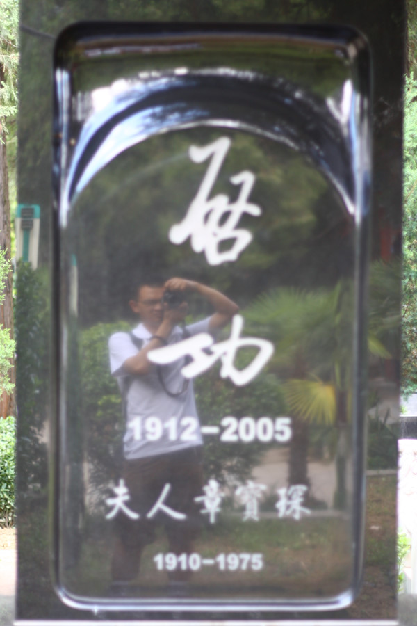

Requiem是一组关于墓碑的照片，这里展现的只是来自北京万安公墓、福田公墓、重庆沙坪坝红卫兵公墓的部分。墓碑保留了一个人存在过的最后痕迹，它们浓缩了人们的全部人生。接触它们是另一种濒死的体验，接触之后会发现，既然死是必然，我们应该尽兴生活，因为只有我们的欢声笑语，才足够嘲讽死神，愚弄时光。图为启功墓碑前拍照时，作者的影子被墓碑映照出来。

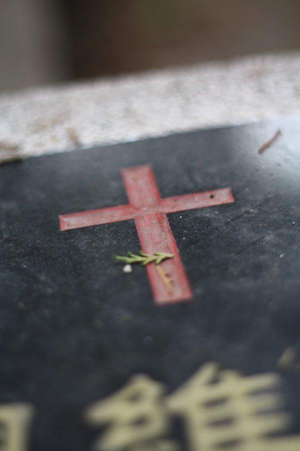

记得巴黎有所墓地，墓门处有块石碑，当地人告诉我上面写的是：不要惧怕我们的存在，因为你早晚将加入我们的行列

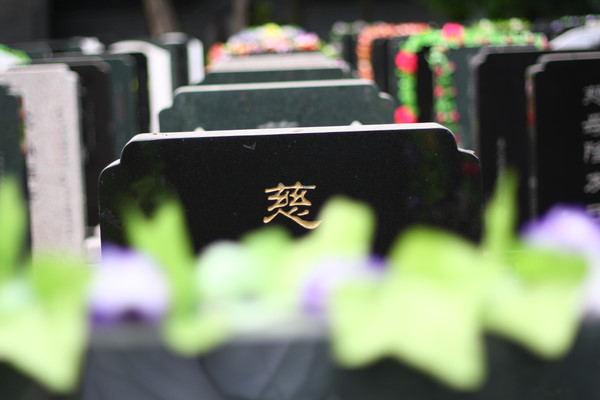

这世上每一块墓碑都记载着一段故事，他们生前或激情澎湃，或悱恻缠绵，或孑然一生，更或如你我默默无闻，但他们终归尘土，唯此毫无区别。

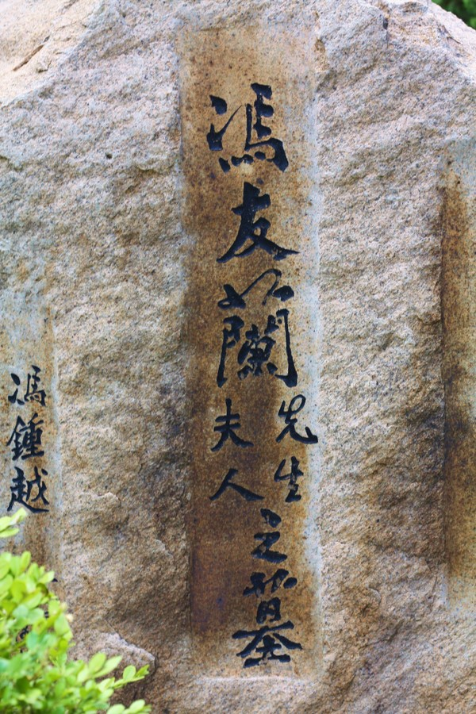

我热衷于寻找公墓，在北京，我最喜欢的是万安公墓和福田公墓，他们在北京京西的香山脚下，很少有游人来到这里，这里安眠的有大师.......

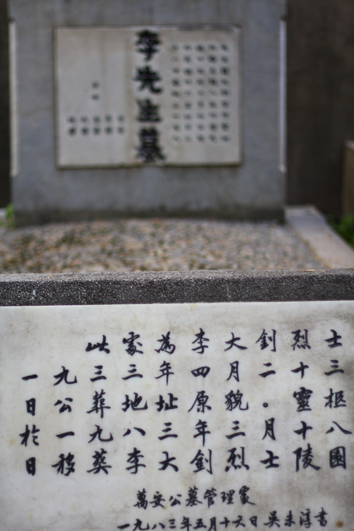

有先行者

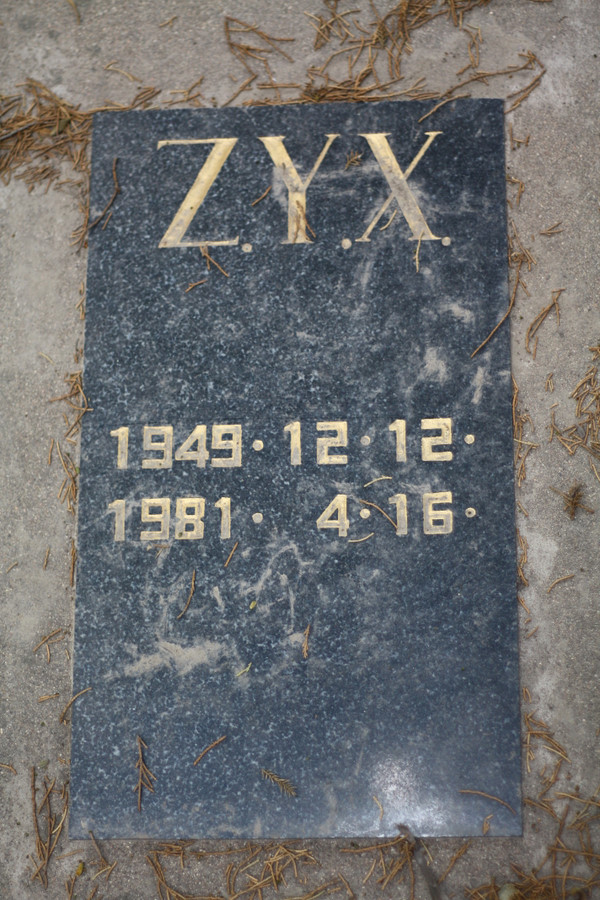

有不愿意告诉别人自己是谁的人.......

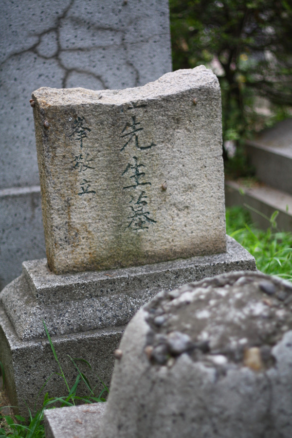

有我们已经不知道是谁的人.....

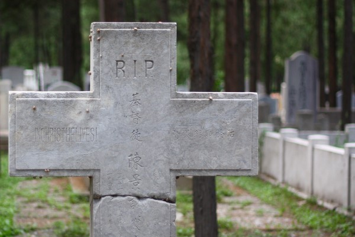

有逐渐黯淡的过往......

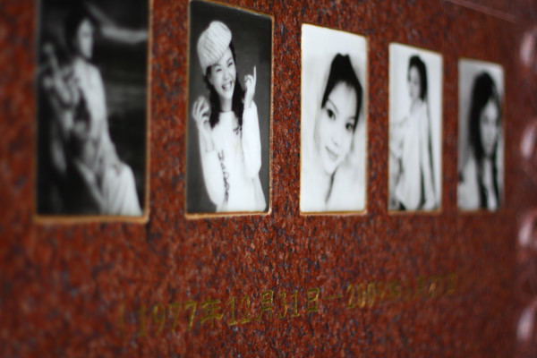

也有曾经花样的年华......

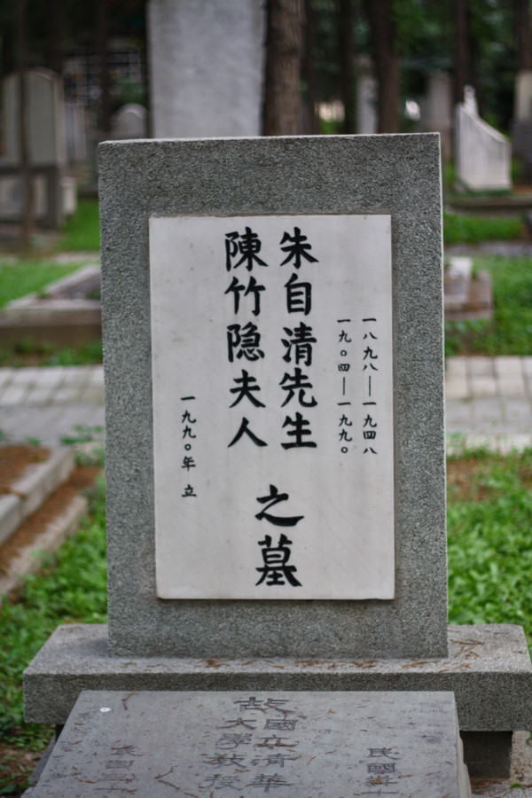

你有在朱自清的墓前读过《背影》么？那种感觉是通透的，你能听到爱的呼吸。

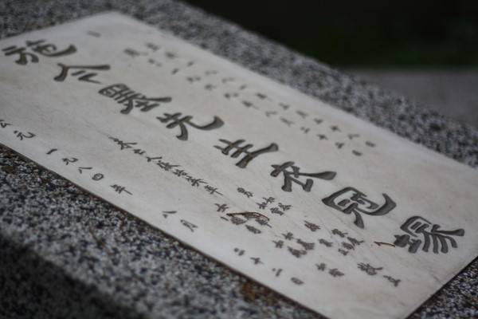

施今墨，北京四大名医之一。我一度不知道为什么这里是他的衣冠冢，后来才知道，原来老先生去世的时候，把遗体捐献给了自己的学生们。

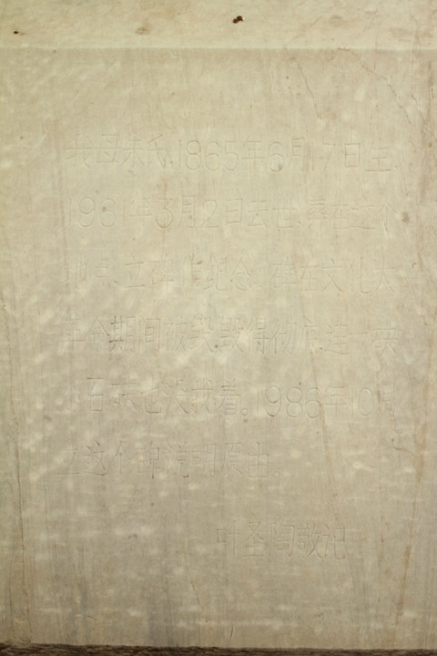

在万安公墓，有两个墓碑是周恩来手书，这是其中之一。我想要讲的故事是另一块墓碑的主人。那是周恩来的义女，当文革到来的时候，她惨遭批斗而死，身为总理的义父却无能为力，他所做的，唯有书写她的墓碑。

.jpg)

李云鹤，这是谁？这个名字你也许并不熟悉，但是提起她的另一个名字，你绝不陌生——江青，死后和周围的墓碑一样大小，一样规格，谁会注意到这里安眠着一个曾经权倾天下的女人。

.jpg)

我热衷于寻找墓碑，寻找的过程是艰苦的，但是偶尔一瞥，往往有难以想象的收获。这个林明清或许并不为人所知，但是左边的小字让这块墓碑难逃一劫。

.jpg)

子林彪，孙林立果。在一行小字里，我触摸到一段潜伏的历史。

.jpg)

同为笔杆子，同样叫王力，一个人造福后世，留泽于读书人。另一位虽然曾经权势熏天，如今被人彻底遗忘。西人有谚：”写值得写的“，大概就是这样吧。

.jpg)

他曾经是九五之尊，也曾经做过阶下之囚。墓碑文字没有涂漆，很容易就把它遗漏，你可曾想象，末代帝陵竟是如此光景。

.jpg)

“我们二人几十年的友情，我却从来没有拥抱过你，大约，你不太喜欢太表面的情感表示；再，中国人不习惯这种表达感情的方式，而我总想拥抱你一次，或亲亲你的发丝如银的白头。我爱你，又十分敬重你，以至不敢，或者不好意思这样表示！”——新公开的曹禺写给巴金的信。

.jpg)

.jpg)
“从牛到爱”你能读懂钱三强的墓志铭么？

.jpg)

生也有涯，学无止境。对于任继愈来说，学，死而不已。

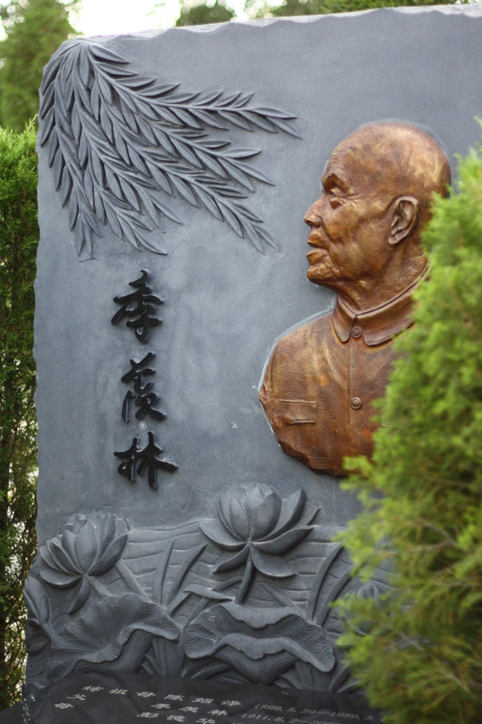

牛棚三季，博物羡人，梵林万里，逝者难追。

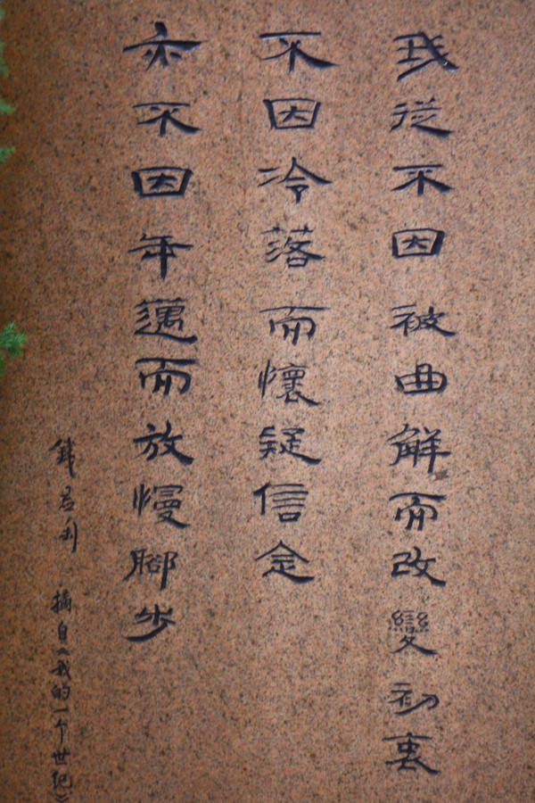

“我从不因被曲解而改变初衷，不因冷落而怀疑信念，亦不因年迈而放慢脚步。”这是我见过的墓碑里最令我震撼的墓志铭，需要度过怎样的人生才敢于在墓碑上写下这样的文字？回到家我寻找这个人的故事——董竹君，一个配得上这墓志铭的女人。

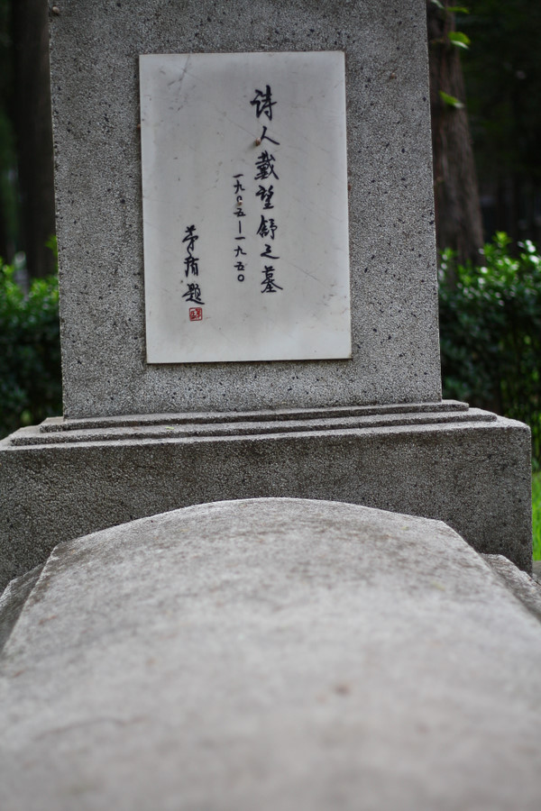

君记否？在那悠长寂寥的雨巷，有个撑着油纸伞，丁香一样，结着愁怨的姑娘？

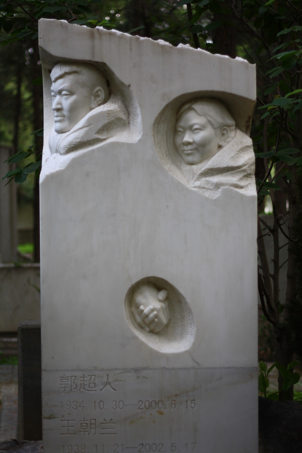

所以牵了手的手，来生还要一起走。新华社社长郭超人，夫妻二人曾携手参与攀登珠峰的报道，墓碑留下了这一刻。

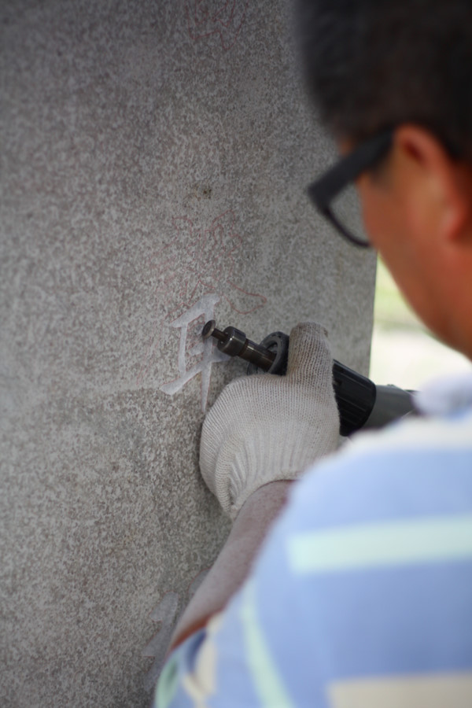

墓地并不是可怕的场所，这里只是一块幽静的土地，它自由开放，没事来和逝去的过往聊聊天，让他们告诉你人生应该如何度过。

不求生如夏花，但求死如秋叶。死亡，不是终点，而是另一个开始。

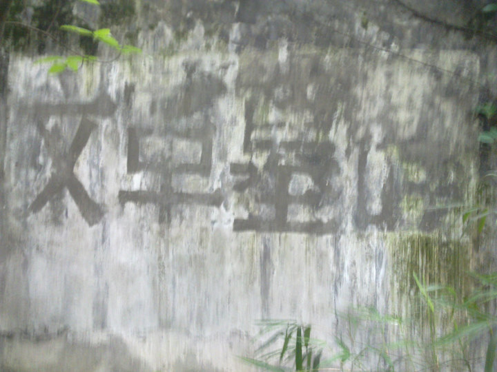

这里是全国仅存的文革红卫兵墓园，坐落在沙坪坝公园的西南，今年5月，我来到这里，聆听他们的声音。

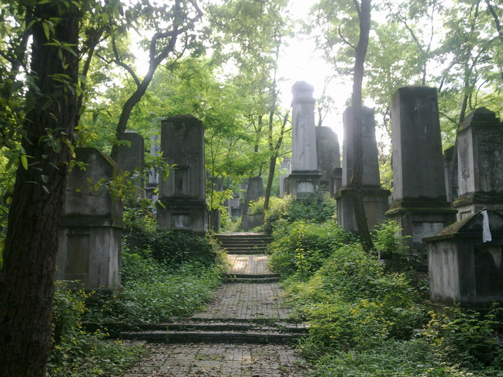

这里的墓碑是一般墓地的10倍大小，走进看看，发现许多墓碑都是合葬墓，一块墓碑下埋葬的，可能是5，甚至10余条生命。

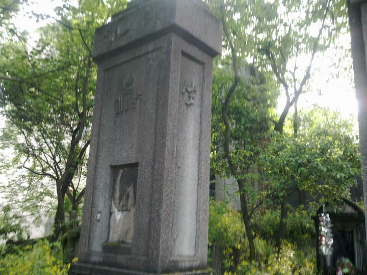

最震撼处是这些墓碑，不像一般的花岗石、大理石，这里的墓碑是用砖粗粗砌起来，然后用碎石子混上水泥浇筑而成的。

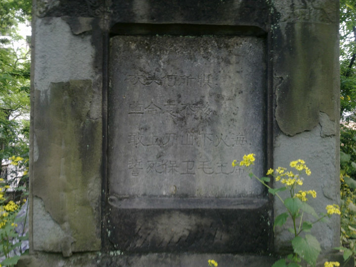

“砍头何所惧，革命志不移。敢上刀山下火海，誓死保卫毛主席！”——墓铭

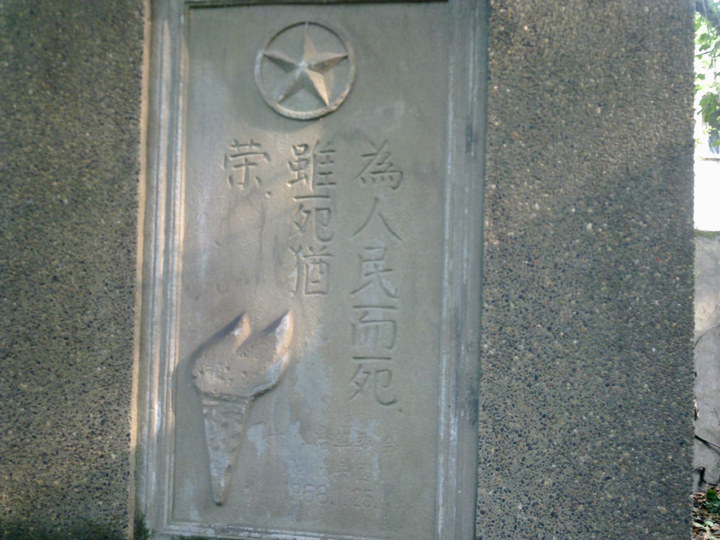

“为人民而死，虽死犹荣！”——墓铭

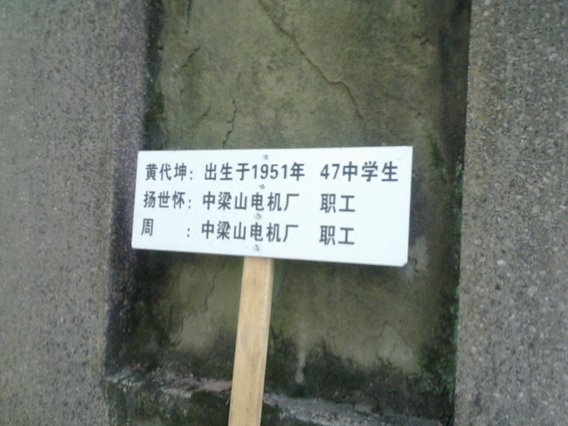

这里杂草丛生，让人感觉这里似乎已经被人遗弃。然而周遭的细节告诉我，即使40年的光阴已经逝去，这里仍旧在某些人的记忆里。

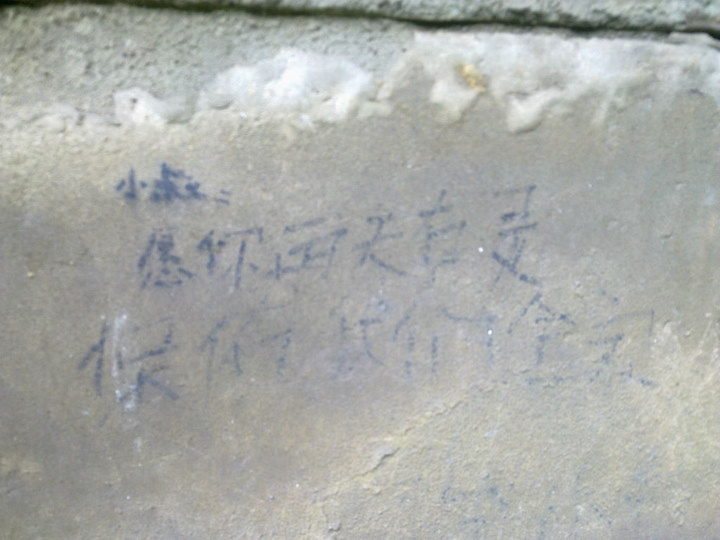

就像一块墓碑背后的这行字，这里对于我们，是不愿再次触碰的历史，对某些人，这里是沉甸甸无法忘怀的亲情。

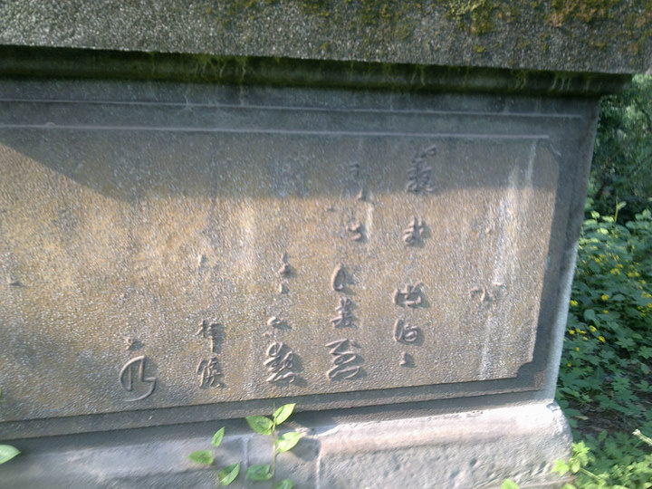

这样的墓碑，明显是赶工之作，墓碑上的铭文是粘上的，岁月并不长久，但是许多文字已经脱落风化，历史在这里随风消逝

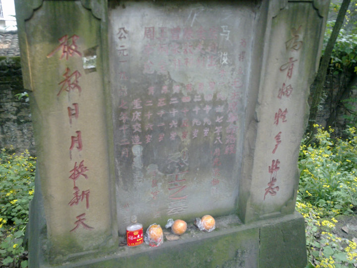

这里最常见到的两句话是来自毛泽东的诗句：“为有牺牲多壮志，敢教日月换新天”。

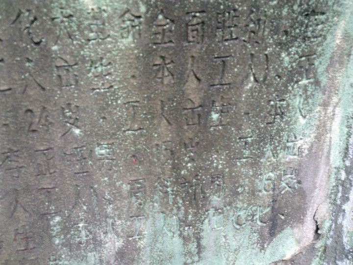

这里有工人、有学生、有干部，细读墓铭，我发现最小的死难者只有14岁......14岁。

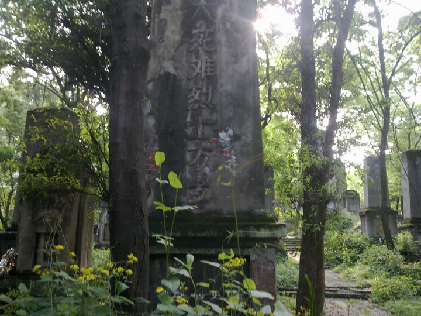

“我们将生命献祭给渎神与杀戮的交响，愿这交响，只属于我们的时代。”安魂Requiem。

